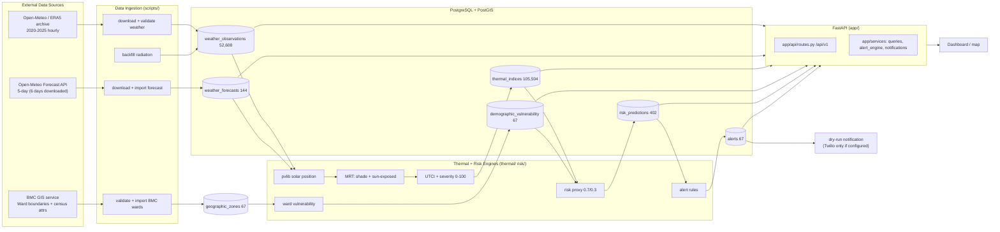

# Architecture Overview

How the **Bhubaneswar Extreme Heatwave Early Warning System** backend
(SIH PS83) is structured, based on the actual repository.

The pipeline is a set of one-off scripts that load data and compute
derived values into PostgreSQL/PostGIS, and a FastAPI service that
queries those tables. This is a *batch-compute, serve-APIs* layout
rather than a live streaming pipeline.



## Directory Structure

```
heatwave-backend/
├── app/                  FastAPI application
│   ├── main.py           app factory, CORS, global error handler, /health
│   ├── core/
│   │   ├── config.py     pydantic-settings (env-driven)
│   │   └── logging.py    structured JSON logging to stdout
│   ├── db/
│   │   ├── base.py       SQLAlchemy DeclarativeBase
│   │   └── session.py    async engine + AsyncSession maker (env pooling)
│   ├── api/routes.py     all HTTP routes under /api/v1
│   ├── models/           SQLAlchemy models (PostGIS-aware)
│   ├── schemas/          Pydantic response models + enums
│   └── services/
│       ├── queries.py            async DB query helpers
│       ├── alert_engine.py       idempotent alert generation
│       └── notifications/        provider abstraction + Twilio
├── thermal/              scientific core (no I/O)
│   ├── utci.py           UTCI calculation (pythermalcomfort)
│   ├── mrt.py            reference-shade + sun-exposed MRT
│   ├── solar_position.py pvlib solar elevation/azimuth
│   ├── risk_classification.py    UTCI bands + severity score
│   └── test_utci.py      standalone UTCI sanity script
├── risk/
│   ├── heat_health_risk.py   0.70/0.30 composite proxy + levels
│   ├── vulnerability.py      provisional ward vulnerability score
│   └── alert_rules.py        per-level messages + recommended actions
├── scripts/              one-off pipelines + checks
│   ├── download_bhubaneswar_weather.py    ERA5 archive download
│   ├── import_bhubaneswar_weather.py      validated observation import
│   ├── backfill_radiation.py              radiation backfill (--dry-run)
│   ├── calculate_historical_thermal_indices.py
│   ├── analyze_historical_heat.py
│   ├── download_bhubaneswar_forecast.py
│   ├── import_bhubaneswar_forecast.py
│   ├── calculate_forecast_thermal_indices.py
│   ├── calculate_forecast_ward_risk.py
│   ├── download_bmc_wards.py / validate_bmc_wards.py / import_bmc_wards.py
│   ├── populate_ward_vulnerability.py
│   ├── calculate_ward_heat_health_risk.py
│   ├── run_dev.py / test_db.py / test_utci.py
│   └── validate_*.py / inspect_bmc_wards.py
├── tests/                pytest suite (48 tests)
├── alembic/              schema migrations (head 9c5f7e2a1b3d)
├── data/
│   ├── raw/              downloaded inputs (gitignored)
│   └── processed/        cleaned GIS + analysis output (gitignored)
├── forecasting/  ingestion/  ml/      empty placeholder packages
├── alembic.ini / requirements.txt / .env.example / .gitignore
└── README.md / DEMO.md
```

## Application Layer

- **`app/main.py`** — builds the FastAPI app with a lifespan that
  probes DB connectivity on startup; registers CORS middleware
  (`allow_origins=settings.cors_origins`, credentials allowed, all
  methods/headers), the `/api/v1` router, `/health` and `/health/db`
  probes, and a catch-all exception handler returning a generic 500.
- **`app/api/routes.py`** — thin routers; each handler depends on
  `get_db()` for an async session, delegates to `app/services/queries.py`,
  maps to Pydantic response schemas, and translates `SQLAlchemyError`
  into 503. No business logic lives in the routes.
- **`app/schemas/`** — Pydantic response models
  (`StationOut`, `ZoneOut`, `VulnerabilityOut`, `ThermalIndexOut`,
  `ForecastOut`, `RiskPredictionOut`, `AlertOut`, `AlertGenerationOut`,
  `RiskZonesResponse`) and the stable enums (`ThermalScenario`,
  `AlertStatus`, `AlertChannel`, `RISK_LEVELS`).
- **`app/services/`** — query helpers (`queries.py`), the idempotent
  alert engine (`alert_engine.py`), and the notification provider
  factory + `DryRunProvider` / `TwilioSmsProvider`.
- **`app/core/config.py`** — `Settings` via `pydantic-settings` reading
  `.env`; all secrets (Twilio SID/token, `DATABASE_URL`) are optional
  or empty-by-default, never hardcoded.
- **`app/core/logging.py`** — single-line JSON logs to stdout with a
  `ts`, `level`, `logger`, `message`, and optional `extra_fields`.
  Configured at startup; noisy uvicorn/sqlalchemy loggers muted.

## Database Layer

- **`Base`** (`app/db/base.py`) is the single `DeclarativeBase` all
  `app/models/*.py` classes extend; `app/models/__init__.py` imports
  them so Alembic's `target_metadata` sees every table.
- **`AsyncSessionLocal`** (`app/db/session.py`) is an
  `async_sessionmaker` bound to one `create_async_engine`. Pooling is
  env-driven: `DB_POOL_SIZE>0` → sized pool (`pool_pre_ping`,
  max_overflow, timeout, recycle); `DB_POOL_SIZE=0` → `NullPool`
  (used by the test suite). `get_db()` yields a request-lifetime
  session.
- **Major tables** (10, created by migration `333567f19fc8`):

| Table | Purpose |
| ----- | ------- |
| `geographic_zones` | 67 BMC wards, `MULTIPOLYGON` EPSG:4326, GIST spatial index |
| `weather_stations` | City grid point (`OPENMETEO_BHUBANESWAR_ERA5`), `POINT` geometry |
| `weather_observations` | 52,608 hourly ERA5 records (2020–2025) |
| `weather_forecasts` | 144 hourly forecast hours (latest generation) |
| `thermal_indices` | 105,504 UTCI/MRT/severity rows per scenario + methodology |
| `demographic_vulnerability` | 67 provisional ward vulnerability scores |
| `risk_predictions` | 402 ward/day risk proxies (`v0.1`, `v0.1-forecast`) |
| `alerts` | 67 generated alerts (pending/sent) |
| `health_outcomes` | Aggregated outcome table — **empty**, for future use |
| `intervention_rules` | Configurable per-level recommended actions |

- **Alembic** — 4 migrations, head `9c5f7e2a1b3d`
  (`333567f19fc8` initial schema → `90e07dff9b52` solar radiation
  columns → `1f3a8c2e9b00` widen `calculation_type` + unique
  constraint → `9c5f7e2a1b3d` performance indexes).

## GIS Architecture

- Ward geometry is real BMC boundary data (BhubaneswarOne
  AdministrativeBoundary service), validated to be exactly
  `W1`–`W67`, repaired with `shapely.make_valid`, and coerced to
  MultiPolygon in **EPSG:4326** before import.
- Columns use `geoalchemy2.Geometry(geometry_type=..., srid=4326,
  spatial_index=True)` (MultiPolygon for zones, Point for stations)
  → PostGIS GIST indexes.
- **`POSTGIS` operations in code**: `ST_Area(geometry::geography)`
  for density (vulnerability pipeline), `ST_AsGeoJSON(z.geometry)`
  for the GeoJSON API.
- **GeoJSON API**: `GET /api/v1/risk-zones` returns one Feature per
  ward (real boundary + risk properties + `valid_for`), filterable by
  `level` and local `forecast_day` (Asia/Kolkata). Geometry is served
  unprojected in 4326.

## Weather Data Pipeline

1. **Historical** — `download_bhubaneswar_weather.py` queries
   Open-Meteo's ERA5 archive for the Bhubaneswar grid point, then
   `import_bhubaneswar_weather.py` validates every row against
   physical ranges (temp −20…60 °C, RH 0…100%, wind 0…100 m/s,
   radiation 0…1500 W/m², pressure 750…1100 hPa), records `source`,
   and skips duplicates (unique `(station, observed_at)`).
2. **Radiation backfill** — `backfill_radiation.py` adds the direct /
   diffuse / DNI components to already-imported observations (ERA5 did
   not carry them in the first pass). It matches timestamps in UTC,
   validates non-negative irradiance, supports `--dry-run`, and never
   overwrites already-populated values.
3. **Forecast** — `download_bhubaneswar_forecast.py` pulls the
   Open-Meteo forecast (6 days = 144 hours) with a stored
   `_generated_at` stamp; `import_bhubaneswar_forecast.py` imports
   only the latest generation idempotently (unique `(station,
   generated_at, forecast_for)`).

All ingestion is repeat-safe (idempotent), range-validated, and
source-attributed.

## Thermal Engine

- `thermal/solar_position.py` — pvlib `get_solarposition` for the grid
  point (20.25°N, 85.75°E), Asia/Kolkata.
- `thermal/mrt.py` — two scenarios: `reference_shade` (MRT = air
  temperature) and `sun_exposed` (MRT = air temperature + `solar_gain`
  delta from `pythermalcomfort`, ASHRAE 55 Effective Radiant Field,
  using DNI + solar elevation). Radiation is never used as MRT
  directly; solar gain is 0 when the elevation ≤ 0.
- `thermal/utci.py` — `pythermalcomfort.models.utci` with input-range
  guards (including wind 0.5–17 m/s) and NaN handling.
- `thermal/risk_classification.py` — official UTCI stress bands and the
  application severity score `100 × (UTCI − 26) / 20`, clamped 0–100.
- Historical and forecast scripts compute UTCI vectorized (numpy) for
  both scenarios with wind clamped to the lower applicability bound,
  store each row's `methodology`, and deduplicate via the unique
  thermal index key.

## Vulnerability / Risk Engine

- `risk/vulnerability.py` — `provisional_vulnerability_score` =
  0.5 × population-percentile-rank + 0.5 × density-percentile-rank
  across the 67 wards; clearly documented as provisional/exposure-only.
  `populate_ward_vulnerability.py` computes it from real BMC
  `totalwardp` census attributes and `ST_Area(::geography)`.
- `risk/heat_health_risk.py` — `heat_health_risk(severity, vulnerability)`
  → score = 0.70×severity + 0.30×vulnerability, then discrete level via
  bands (EXTREME ≥ 80, VERY_HIGH ≥ 60, HIGH ≥ 40, MODERATE ≥ 20).
- `calculate_ward_heat_health_risk.py` — historical reference event
  (the 2020–2025 UTCI maximum) scored for all wards, upserted with
  `ON CONFLICT ... DO UPDATE`.
- `calculate_forecast_ward_risk.py` — daily severity = max local-day
  sun-exposed UTCI severity, T+1…T+5, combined with vulnerability per
  ward, upserted as `v0.1-forecast`.

## Alert Architecture

- `risk/alert_rules.py` — `ALERT_RULES` keyed by risk level with
  message templates and recommended actions; `MIN_ALERT_LEVEL = HIGH`;
  default channel `sms`.
- `app/services/alert_engine.py` — `generate_alerts(session)` takes the
  latest forecast generation, finds each ward's peak five-day risk, and
  creates one `Alert` per ward at/above HIGH, deduplicating against
  existing pending/sent alerts (idempotent).
- `app/services/notifications/` — `NotificationProvider` ABC,
  `DryRunProvider` (prints + returns a marker, never transmits),
  `TwilioSmsProvider` (httpx POST to Twilio Messages API with Basic
  auth; raises if SID/token/from missing). The factory
  `get_notification_provider()` returns `DryRunProvider` whenever
  `NOTIFICATION_DRY_RUN=true` (the default).
- API: `GET /api/v1/alerts`, `POST /api/v1/alerts/generate`,
  `POST /api/v1/alerts/{id}/send`.

## API Architecture

All routes under `/api/v1` (plus `/health`, `/health/db`):

| Method | Path | Group |
| ------ | ---- | ----- |
| GET | `/health` | Health |
| GET | `/health/db` | Health |
| GET | `/api/v1/stations` | Stations |
| GET | `/api/v1/zones` | Zones |
| GET | `/api/v1/zones/{zone_code}` | Zones |
| GET | `/api/v1/zones/{zone_code}/current-risk` | Risk |
| GET | `/api/v1/zones/{zone_code}/forecast` | Forecast |
| GET | `/api/v1/thermal/latest` | Thermal |
| GET | `/api/v1/thermal/history?calculation_type&limit&offset` | Thermal |
| GET | `/api/v1/forecast` | Forecast |
| GET | `/api/v1/vulnerability` | Risk |
| GET | `/api/v1/risk-zones?level&forecast_day` | Risk |
| GET | `/api/v1/alerts` | Alerts |
| POST | `/api/v1/alerts/generate` | Alerts |
| POST | `/api/v1/alerts/{alert_id}/send` | Alerts |

Notes: pagination is capped (`limit` ≤ 500, `ge=1`); `level` is
whitelisted against `RISK_LEVELS` (else 422); forecast-day filtering
uses deterministic local-day logic (`prediction_for AT TIME ZONE
'Asia/Kolkata'`) with `forecast_day` always passed as a bound
parameter.

## Dependency Flow

```
routes (app/api/routes.py)
   │  depends on get_db() → AsyncSession
   ├─► services/queries.py        → app/models/* (SQLAlchemy, parametrized)
   ├─► services/alert_engine.py   → risk/alert_rules.py, app/models
   └─► services/notifications/    → app/core/config.py (settings)

thermal/ and risk/ (pure functions, no DB, no I/O)
   ► imported by scripts/ (pipeline execution) and tests

scripts/ ► app.db.session, app.models, thermal/, risk/  (one-off execution)

The API layer depends on the query service; neither the thermal nor
risk packages import from app/, keeping ownership one-directional and
avoiding circular dependencies.
```

## Runtime Flow

```
HTTP request
   │
   ▼
router handler (app/api/routes.py)
   │  validate query params (FastAPI/Pydantic)
   ▼
service query (app/services/queries.py)
   │  SELECT via SQLAlchemy over async session
   ▼
PostgreSQL / PostGIS
   ▼
response schema serialization (app/schemas/api.py)
   │
   ▼
JSON response
```

On DB failure the router raises 503 with a generic message; on
unexpected exceptions the global handler returns 500 "Internal server
error." — never a traceback.

## Deployment Boundaries

- **Current**: local development deployment — `scripts/run_dev.py`
  runs uvicorn bound to `127.0.0.1:8000` with auto-reload; the DB is a
  local PostgreSQL 14+ (project tested on PostgreSQL 18 / PostGIS 3.6).
  Data is prepared by running the idempotent pipelines in README order.
- **Future production layout** (see TODO.md / SECURITY.md): a
  managed/replicated PostgreSQL with TLS, the API behind TLS + a
  reverse proxy with rate limiting and security headers, scheduled
  forecast refresh, a secret manager for Twilio credentials, and
  authentication/RBAC around alert-generation/send endpoints.