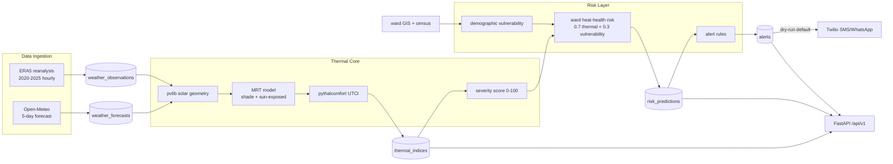

# Bhubaneswar Extreme Heatwave Early Warning System

Backend for **SIH Problem Statement 83** — Extreme Heatwave Early Warning
and Human Thermal Stress Index.

This MVP computes a ward-level heat-health risk for all 67 Bhubaneswar
Municipal Corporation (BMC) wards using ERA5 reanalysis ground-truth
history, a real 5-day Open-Meteo forecast, and official BMC ward GIS data.
It publishes the resulting thermal stress indices and risk surfaces through
a FastAPI service.

## Project Documentation

- [System Design](DESIGN.md) — why the backend is built this way
- [Architecture](ARCHITECTURE.md) — how the backend is structured
- [Security Policy](SECURITY.md) — controls, gaps, and hardening checklist
- [Project Backlog](TODO.md) — prioritized engineering backlog
- [AI Development Context](CHATMEMORY.md) — safe context for coding assistants

## Project Status

MVP complete (Milestones M1–M11, hardening polish pass P1–P20).

- Human thermal stress is modelled with **UTCI** (Universal Thermal
  Climate Index), using the operational **pythermalcomfort** implementation.
- Two exposure scenarios per observation:
  - `reference_shade` — MRT assumed equal to screen-level air temperature.
  - `sun_exposed` — MRT = air temperature + solar radiation gain
    (`thermal/mrt.py`) using pvlib solar geometry.
- Ward heat-health risk is an **explainable proxy**:
  `0.70 × thermal severity + 0.30 × demographic vulnerability`.
- Mortality / hospitalization risk fields are intentionally left **NULL**
  until genuine aggregated health-outcome labels are available.

## Architecture



Scripts, thermal math, risk proxy, alerts, and the FastAPI surface:

```
scripts/          one-off data pipelines (ingestion + calculation)
thermal/          UTCI, MRT, solar position, risk classification
risk/             vulnerability, heat-health risk proxy, alert rules
app/
  api/routes.py   FastAPI routes (/api/v1)
  services/       query helpers, alert engine, notification providers
  models/         SQLAlchemy models (PostGIS)
  db/             async engine + session (env-driven pooling)
  core/config.py  pydantic-settings configuration
  core/logging.py structured JSON logging
alembic/          schema migrations
tests/            pytest suite (48 tests)
```

Data flow:

```
ERA5 / Open-Meteo ──► weather_observations / weather_forecasts
        │                       │
        │                       ▼
        │              thermal_indices (UTCI, both scenarios)
        ▼                       │
   SieveNet targets        daily severity per ward
        │                       │
        ▼                       ▼
ward GIS + census ──► demographic_vulnerability ──► risk_predictions
                                                          │
                                                          ▼
                                                     alerts ──► SMS
```

## Quickstart

### 1. Environment

- Python 3.12
- PostgreSQL 14+ with PostGIS (project tested on PostgreSQL 18 / PostGIS 3.6)
- `pvlib`, `pythermalcomfort`, `pandas`, `pydantic`, `fastapi`, `sqlalchemy`,
  `alembic`, `geopandas`, `httpx`, `pytest`

```powershell
python -m venv .venv
.venv\Scripts\pip install -r requirements.txt
Copy-Item .env.example .env   # then set DATABASE_URL
```

### 2. Database

```powershell
.venv\Scripts\alembic upgrade head
```

### 3. Data pipelines (in order)

```powershell
.venv\Scripts\python.exe -m scripts.import_bmc_wards
.venv\Scripts\python.exe -m scripts.download_bhubaneswar_weather
.venv\Scripts\python.exe -m scripts.import_bhubaneswar_weather
.venv\Scripts\python.exe -m scripts.backfill_radiation
.venv\Scripts\python.exe -m scripts.calculate_historical_thermal_indices
.venv\Scripts\python.exe -m scripts.analyze_historical_heat
.venv\Scripts\python.exe -m scripts.populate_ward_vulnerability
.venv\Scripts\python.exe -m scripts.calculate_ward_heat_health_risk
.venv\Scripts\python.exe -m scripts.download_bhubaneswar_forecast
.venv\Scripts\python.exe -m scripts.import_bhubaneswar_forecast
.venv\Scripts\python.exe -m scripts.calculate_forecast_thermal_indices
.venv\Scripts\python.exe -m scripts.calculate_forecast_ward_risk
```

All pipelines are idempotent and may be re-run safely.

### 4. API

```powershell
Copy-Item .env.example .env   # set DATABASE_URL and pool/twilio settings (first)
.venv\Scripts\python.exe -m scripts.run_dev
```

or run uvicorn directly:

```powershell
.venv\Scripts\python.exe -m uvicorn app.main:app --reload --port 8000
```

Interactive docs at http://127.0.0.1:8000/docs

### Environment variables (see `.env.example`)

| Variable                  | Default | Purpose                                        |
| ------------------------- | ------- | ---------------------------------------------- |
| `DATABASE_URL`            | —       | Postgres DSN, e.g. `postgresql+asyncpg://...`  |
| `DB_POOL_SIZE`            | `5`     | Connection pool size (`0` = NullPool, one conn per session; used by tests) |
| `DB_MAX_OVERFLOW`         | `10`    | Overflow connections above pool size           |
| `DB_POOL_TIMEOUT`         | `30.0`  | Seconds to wait for a pooled connection        |
| `DB_POOL_RECYCLE`         | `1800`  | Recycle pooled connections (seconds)           |
| `CORS_ORIGINS`            | see example | Comma-separated allowed browser origins    |
| `NOTIFICATION_DRY_RUN`    | `true`  | Log notifications instead of sending           |
| `TWILIO_SMS_FROM`         | —       | Twilio SMS sender number                       |
| `TWILIO_WHATSAPP_FROM`    | —       | Twilio WhatsApp sender (matches `twilio_sms_from`) |
| `TWILIO_ACCOUNT_SID`      | —       | Twilio account SID                             |
| `TWILIO_AUTH_TOKEN`       | —       | Twilio auth token (never commit)               |
| `ALERT_RECIPIENT_PHONE`   | —       | Recipient for generated alerts                 |

## API Routes

| Method | Path                            | Description                              |
| ------ | ------------------------------- | ---------------------------------------- |
| GET    | `/health`                       | Liveness probe                           |
| GET    | `/health/db`                    | Database connectivity probe              |
| GET    | `/api/v1/stations`              | Weather stations                         |
| GET    | `/api/v1/zones`                 | All 67 wards                             |
| GET    | `/api/v1/zones/{code}`          | Single ward                              |
| GET    | `/api/v1/zones/{code}/current-risk` | Latest risk prediction for a ward     |
| GET    | `/api/v1/zones/{code}/forecast` | 5-day ward risk outlook                  |
| GET    | `/api/v1/thermal/latest`        | Latest forecast thermal indices          |
| GET    | `/api/v1/thermal/history`       | Historical thermal indices (paginated)   |
| GET    | `/api/v1/forecast`              | Latest 6-day weather forecast            |
| GET    | `/api/v1/vulnerability`         | Ward vulnerability scores                |
| GET    | `/api/v1/risk-zones`            | GeoJSON FeatureCollection (one per ward, latest forecast day) |
|        | `?level=`                      | Filter by risk level: HIGH, VERY_HIGH (case-insensitive) |
|        | `?forecast_day=`               | Local-day filter, ISO date (Asia/Kolkata)  |
| GET    | `/api/v1/alerts`                | Generated alerts                         |
| POST   | `/api/v1/alerts/generate`       | Create alerts from latest forecast (idempotent) |
| POST   | `/api/v1/alerts/{id}/send`      | Deliver an alert (dry-run by default)    |

## Notifications

SMS alerts default to **dry-run** (`NOTIFICATION_DRY_RUN=true`): messages are
logged, never sent. To enable real delivery, disable dry-run and configure
Twilio credentials via environment variables (see `.env.example`).

## Scientific Notes

- **MRT discipline**: solar radiation is never used directly as mean radiant
  temperature. The shade reference uses air temperature; sun-exposed MRT adds
  the physically-modelled radiative gain (`thermal/mrt.py`).
- **UTCI**: operational implementation with wind clamped to its applicability
  domain (0.5–17 m/s). Categories follow official bands; the 0–100 severity
  score is an application-specific monotonic transform of UTCI (°C).
- **Risk proxy**: composite only; fields named `mortality_risk_score` /
  `hospitalization_risk_score` remain NULL (no real health-outcome labels).

## Tests

```powershell
.venv\Scripts\python.exe -m pytest -v
```

48 tests cover UTCI/MRT physics, severity classification, the risk proxy,
vulnerability scoring, API behaviour (pagination, GeoJSON, CORS, error
handling, secret hygiene), alert generation/delivery, and scientific-sanity
regressions (radiation is never used directly as MRT, shade<sun-exposed
during the day, zero solar gain at night, UTCI reference ≈ 24.6 °C).

## Logging

Structured JSON lines to stdout (`app/core/logging.py`). Startup/shutdown,
DB health, query failures, and alert generation/send summaries are logged
with `extra_fields`; API errors return a generic message and never leak
stack traces or credentials.

## Key Repository Facts

- 52,608 hourly ERA5 observations (2020–2025), 105,216 historical thermal
  indices, 144 forecast hours, 105,504 thermal indices total.
- Peak sun-exposed UTCI in the ERA5 window: **49.70 °C** on 2023-06-16T12:00.
- 402 risk predictions (67 historical peak + 335 forecast), 67 ward alerts
  generated at HIGH/VERY_HIGH from the current forecast.
- Geographic zones are EPSG:4326 with PostGIS geometry (MultiPolygon).